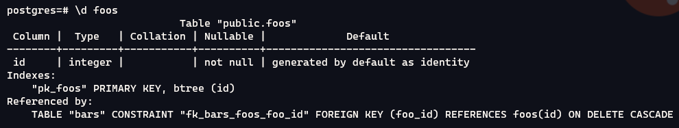
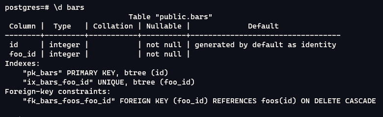

# One to One Failure

This repository exists to reproduce a bug found in sequelize auto model generation where a one to one relationship has a one to many relationship

## Generated Code

### Expected

```js
  foos.hasOne(bars, { as: "bar", foreignKey: "foo_id"});
```

### Actual

```js
  foos.hasMany(bars, { as: "bars", foreignKey: "foo_id"});
```

## Testing

1. Run `docker-compose up --build -d`
2. Connect to database
```sh
psql "hostaddr=127.0.0.1 \
port=5555 \
user=postgres \
password=SomePassword \
dbname=postgres"
```
3. Inspect the schema
```sh
\d foos
```

```sh
\d bars
```

4. Install node dependencies:
```sh
npm i
```
5. Generate models:
```sh
npm start
```
6. Confirm `models/init-models.js` models the relationship as a one to many (foo -> bars).